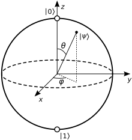

_Image from Navi https://unsplash.com/ko/@navi_photography_

## Quantum Bits

Bit는 일반적인 고전적인 컴퓨터에서 0또는 1을 가질 수 있는 객체이다. 우리는 이러한 수많은 비트들을 이용해서 정보를 저장하고, 저장된 정보들을 이용해 고전적인 의미의 컴퓨팅을 수행한다.

하지만, Quantum Bit(줄여서 Qbit)는 Bit와 달리 중첨된 **상태**를 가질 수 있다. 아래의 수식을 확인하자.

$$ 
\begin{equation} 
  \ket{\psi} = \alpha\ket{0} + \beta\ket{1} 
\end{equation}
$$

> 본 글에서는 해당 표현이 정확히 물리학적으로 무엇을 의미하는지 설명할 계획이 없다. 단순히 CS의 관점에서 **상태**, 0 또는 1을 가지는 **Object**라고 해석할 것이며, 추후에 이를 다룬다면 Backlink를 걸어두도록 하겠다. 
{: .prompt-warning}

위 수식에서 $\alpha$와 $\beta$는 Complex Number이며 Linear Algebra의 Vector앞에 붙는 계수라고 생각하면 쉽다. 또한, $\ket{0}$과 $\ket{1}$을 Vector Space의 Orthonormal Basis라고 취급할 수 있으며, ***computational basis states***라고 부른다.

또한, 일반물리학에서 간단하게 배운 양자 지식을 가져오면 진폭의 제곱이 확률을 의미하므로 위 표현식은 아래 제한조건을 가진다.

$$
\begin{equation}
  {\vert\alpha\vert}^2 + {\vert\beta\vert}^2 = 1
\end{equation}
$$

이제 $\ket{\psi}$를 완벽하게 측정할 수만 있다면 우리는 고작 2가지의 정보밖에 저장하지 못하는 기존 Bit에 비해 압도적으로 많은 정보량을 저장할 수 있는 ($\alpha$와 $\beta$가 무려 **복소수**에서 $(2)$만 만족하면 임의의 값을 가질 수 있으므로) 새로운 정보체계를 발견했다고 볼 수 있다. 하지만, 이는 불가능하다.  

고전적인 Bit의 작동방식을 생각해보자. Bit에 어떤 값을 저장했다면, 나중에 비트를 불러와서 0인지 1인지 구분할 수 있다. 즉, 고전적인 의미의 Bit에서는 Bit를 측정하는것이 가능하다. 그러나 Quantum Bit는 이러한 과정이 불가능하다. Quantum Bit에 무엇이 저장되어 있는지 측정하면 고전적인 Bit와 동일하게 0또는 1의 값만 측정된다. 물론 ${\vert\alpha\vert}^2$의 확률로 상태 $\ket{0}$이, ${\vert\beta\vert}^2$의 확률로 상태 $\ket{1}$이 측정되긴 하지만, 이 $\alpha$와 $\beta$의 값은 측정으로부터 알아낼 수 없다. 

이러한 이유로 인해 흔히 퍼진 인식

> 양자컴퓨터는 고전컴퓨터들을 모두 압도할 수 있다

는 사실이 아니며, 양자컴퓨터는 고전컴퓨터들이 느리게 풀어야만 하는 일부 문제를 빠르게 풀 수 있도록 도와주는 정도에 그친다.

> 이에 대해 간략한 설명을 덧붙이자면, 양자컴퓨터의 빠른 계산속도는 이 Qbit들에 대해서 상태를 *측정*하지 않은 채로 냅둔다는 그 자체에서 기인한다. 지금은 이 말이 무슨말인지 잘 와닿지 않을 수 있으나, 정보가 Hidden된 그대로 두는것이 특정한 경우에서 더 효과적인 계산을 가능하게 한다는 뜻이다. 하지만 안타깝게도 어떤 문제들이 더 효과적으로 풀리는지에 대한 논쟁 - P, NP 집합이 있으면 BQP(양자컴퓨터로 빠르게 풀 수 있는 문제)는 어떤 관계를 갖느냐 - 는 아직 명확히 밝혀지지 않았다.
{: .prompt-tip}

다음으로 넘어가기 전에 한 가지 특별한 상태의 Qbit만 살펴보고 넘어가도록 하자.

$$
\begin{equation}
  \ket{+} = \frac{1}{\sqrt{2}}\ket{0} + \frac{1}{\sqrt{2}}\ket{1}
\end{equation}
$$

이 Qbit는 두 가지의 상태를 가질 확률이 정확히 $\frac{1}{2}$인 Qbit이다. 앞으로 이 상태는 특별히 $\ket{+}$으로 표현한다.

## Mathmatical Expression of Quantum Bits

$(2)$의 제한을 만족하도록 보다 일반적으로 $\ket{\psi}$를 기술하면 아래와 같다.

$$
\begin{equation}
  \ket{\psi} = e^{i\gamma}\left(\cos{\frac{\theta}{2}}\ket{0} + e^{i\varphi}\sin{\frac{\theta}{2}}\ket{1}\right)
\end{equation}
$$

여기서 $\theta$, $\gamma$, $\varphi$는 모두 실수이다.

> 복소수 하나가 $a+bi$ 꼴로 표현되는데($a$, $b$는 실수) 이러한 복소수 계수가 두 개이므로 $\mathbb{R}^4$가 되어야 하고, 제한조건이 하나 걸려있으므로 $\mathbb{R}^3$이 됨을 자연스레 알 수 있다.
{: .prompt-tip}

$(4)$의 맨 앞에 붙어있는 $e^{i\gamma}$는 무시할 수 있기에 (향후 Chapter 2에서 다루겠다) 더 간단하게 아래와 같이 쓸 수 있다.

$$
\begin{equation}
  \ket{\psi} = \cos{\frac{\theta}{2}}\ket{0} + e^{i\varphi}\sin{\frac{\theta}{2}}\ket{1}
\end{equation}
$$

이제 이는 아래 그림과 같은 구면위에서 표현할 수 있는데, 이 구면을 Bloch Sphere라고 칭한다.

_https://en.wikipedia.org/wiki/Bloch_sphere_

아무래도 basis의 계수가 복소수까지 가능하다보니, 시각화한 형태가 흔히 상상하던 2차원 평면 모양이 아니라 3차원의 구면모양으로 나타나게 된다. 단일 Qbit에 대해서는 몹시 만족스러운 시각화 도구지만 안타깝게도 다중 Qbit에서는 이 방법을 사용하기 어렵다.

앞으로 간단한 Gate들을 설명할텐데 해당 Gate가 어떻게 작동하는지 시각적으로 이해하는 과정에서 요긴하게 사용할 수 있다.

## Multiple Qbits

이제 두 개의 Qbit가 있다고 가정해보자. 두 개의 Qbit가 가능한 상태는

$$
\ket{00}, \ket{01}, \ket{10}, \ket{11}
$$

가 있으므로,

$$
\begin{equation}
  \ket{\psi} = \alpha_{00}\ket{00} + \alpha_{01}\ket{01} + \alpha_{10}\ket{10} + \alpha_{11}\ket{11}
\end{equation}
$$

와 같이 쓸 수 있다. 역시나 각 계수(진폭)의 제곱이 각 상태가 관측될 확률이므로 아래와 같은 Normalization을 따라야만 한다.

$$
\begin{equation}
  \sum_{x \in \{0, 1\}^2} \vert\alpha_x\vert^2 = 1
\end{equation}
$$

이처럼 여러개의 Qbit가 있을땐 일부 Qbit에 대해서만 *측정*을 수행하는것도 가능한데, 만약 첫 번째 Qbit에 대해서만 측정을 수행하여 0을 얻었다면 위 상태는 아래처럼 다시 쓸 수 있다.

$$
\begin{equation}
  \ket{\psi} = \frac{\alpha_{00}\ket{00} + \alpha_{01}\ket{01}}{\sqrt{\vert\alpha_{00}\vert^2 + \vert\alpha_{01}\vert^2}}
\end{equation}
$$

한편 두 개의 Qbit가 있을때 *Bell State*혹은 *EPR pair*라고 불리는 중요한 상태가 있다.

$$
\begin{equation}
  \frac{\ket{00} + \ket{11}}{\sqrt{2}}
\end{equation}
$$

상태 $\ket{00}$과 $\ket{11}$이 각각 $\frac{1}{2}$의 확률로 가능한 경우인데, 이렇다 보니 첫 번재 Qbit의 값이 결정되면 두 번째 Qbit의 값 역시 정해지는 특징을 갖는다. 이 두 Qbit간의 연결성은 그 어떤 *Classical System*상에서의 연결보다 강하다.

참고로 *EPR*은 *Einstein*, *Podolsky*, *Rosen*을 일컫는다.

[ft-1]: Quantum Computation and Quantum Onformation 10th Anniversary Edition
